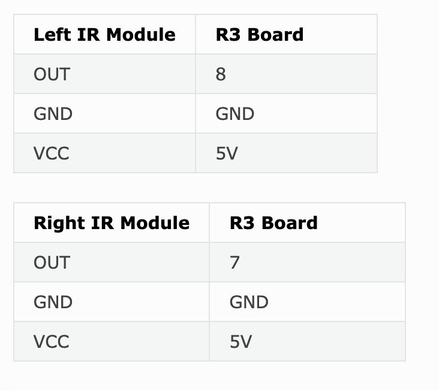

# Human Following Robot
My project is a human following robot which you can guide with your hand. It is coded with C++ and uses arduino technology. Some of the technical hardware includes an R3 board, an ultrasonic sensor, obstacle detection sensors, motors, a motor driver and a 9V battery. This robot can act as a cute pet like a dog or cat but it doesn't shed!

| **Engineer** | **School** | **Area of Interest** | **Grade** |
|:--:|:--:|:--:|:--:|
| Selin A | Castilleja School | Computer Science | Incoming Sophomore


# Final Milestone: Follow My Hand

<iframe width="560" height="315" src="https://www.youtube.com/embed/tgDn-TLOsOQ?si=PxR3k6936rSOmebF" title="YouTube video player" frameborder="0" allow="accelerometer; autoplay; clipboard-write; encrypted-media; gyroscope; picture-in-picture; web-share" referrerpolicy="strict-origin-when-cross-origin" allowfullscreen></iframe>

With this milestone I am now able to guide my robot with my hand. My biggest challenges at BSE were coding and wiring since I didn't know 
much about wiring and had not written code for arduino or any code in C++ before. Throughout this experience I have learned a lot about coding, arduinos and different kinds of sensors. I also learned about problemsolving, being resourceful and being patient. In the future I hope to learn more programming languages, dive into AI and create more fun projects.

# Schematics: Final Milestone 
<!---->

<!---->


# Code: Final Milestone

```c++
#include <Wire.h>
#include <MPU6050.h>

MPU6050 mpu;

// Motor pins
const int A_1B = 5;
const int A_1A = 6;
const int B_1B = 9;
const int B_1A = 10;

const int rightIR=7;
const int leftIR=8;

const int trigPin = 3;
const int echoPin = 4;


int baseSpeed = 250;           // Base motor speed
float correctionFactor = 60;  // How strongly to correct based on angle
float angleThreshold = 1.5;    // Degrees threshold for correction

unsigned long lastTime = 0;
float zAngle = 0; // Yaw angle in degrees

float readSensorData() {
  digitalWrite(trigPin, LOW);
  delayMicroseconds(2);
  digitalWrite(trigPin, HIGH);
  delayMicroseconds(10);
  digitalWrite(trigPin, LOW);
  float distance = pulseIn(echoPin, HIGH) / 58.00; //Equivalent to (340m/s*1us)/2
  return distance;
}


void moveForward(int leftSpeed, int rightSpeed) {
   // Drive forward
    analogWrite(A_1A, rightSpeed);
    analogWrite(A_1B, 0);
    analogWrite(B_1A, 0);
    analogWrite(B_1B, leftSpeed);
}

void stopMoving() {
   // stop moving
    analogWrite(A_1A, 0);
    analogWrite(A_1B, 0);
    analogWrite(B_1A, 0);
    analogWrite(B_1B, 0);
}

void turnRight(int rightSpeed, int leftSpeed) {
  analogWrite(A_1B, rightSpeed);
  analogWrite(A_1A, 0);
  analogWrite(B_1B, leftSpeed);
  analogWrite(B_1A, 0);
}

void turnLeft(int rightSpeed, int leftSpeed) {
  analogWrite(A_1B, 0);
  analogWrite(A_1A, rightSpeed);
  analogWrite(B_1B, 0);
  analogWrite(B_1A, leftSpeed);
}

void setup() {
  Serial.begin(9600);

  // Motor pins as output
  pinMode(A_1A, OUTPUT);
  pinMode(A_1B, OUTPUT);
  pinMode(B_1A, OUTPUT);
  pinMode(B_1B, OUTPUT);

    //IR obstacle
  pinMode(leftIR,INPUT);
  pinMode(rightIR,INPUT);

  //ultrasonic
  pinMode(echoPin, INPUT);
  pinMode(trigPin, OUTPUT);

  // Initialize MPU6050
  Wire.begin();
  mpu.initialize();

  if (!mpu.testConnection()) {
    Serial.println("MPU6050 connection failed!");
    while (1);
  }

  Serial.println("MPU6050 ready!");
  lastTime = millis();
}

void loop() {
  int16_t gx, gy, gz;
  mpu.getRotation(&gx, &gy, &gz);

  // Convert gyro Z axis to degrees per second (yaw rate)
  float gz_dps = gz / 131.0;

  // Calculate time elapsed
  unsigned long now = millis();
  float dt = (now - lastTime) / 1000.0; // seconds
  lastTime = now;

  // Integrate gyro rate to get angle
  zAngle += gz_dps * dt;

  // Default speeds
  int leftSpeed = baseSpeed -30;
  int rightSpeed = baseSpeed;

  // Correction logic based on angle
  if (zAngle > angleThreshold) {
    // Robot has turned right too much, slow right motor to correct left
    leftSpeed -= correctionFactor * abs(zAngle);
  } else if (zAngle < -angleThreshold) {
    // Robot has turned left too much, slow left motor to correct right
    rightSpeed -= correctionFactor * abs(zAngle);
  }

  // Constrain speeds to 0–255
  leftSpeed = constrain(leftSpeed, 0, 255);
  rightSpeed = constrain(rightSpeed, 0, 255);

  float distance = readSensorData();
  Serial.println(distance);

  int left = digitalRead(leftIR);  // 0: Obstructed   1: Empty
  int right = digitalRead(rightIR);

  if (distance>2 && distance<30) {
    moveForward(leftSpeed, rightSpeed);
  }else if(!left&&right){
    turnLeft(leftSpeed, rightSpeed);
  }else if(left&&!right){
    turnRight(leftSpeed, rightSpeed);
  } else {
    stopMoving();
    resetYaw();
  }

    Serial.print("Yaw angle: ");
    Serial.print(zAngle);
    Serial.print(" | L: ");
    Serial.print(leftSpeed);
    Serial.print(" R: ");
    Serial.println(rightSpeed);

  // delay(10);
}

void resetYaw() {
  if (abs(zAngle) > angleThreshold) {
    zAngle = 0;
    lastTime = millis();
  }
}

```


# Second Milestone: Obstacle Avoidance 

<iframe width="560" height="315" src="https://www.youtube.com/embed/_iu2N_n0sqk?si=byBmCuGjmf6qJCBC" title="YouTube video player" frameborder="0" allow="accelerometer; autoplay; clipboard-write; encrypted-media; gyroscope; picture-in-picture; web-share" referrerpolicy="strict-origin-when-cross-origin" allowfullscreen></iframe>

During my second milestone I enabled my robot to avoid obstacles, speed up, and follow a line. I did this by programing the obstacle detection modules to react to obstacles by turning or going backwards. Something that has been surprising me so far is that tuning for sensors and speed calibration matters a lot. I initially thought that tuning was not essential bu an add on, and I have come to realise how important it is through this project. I am also improving a lot at coding C++ and the syntax comes to me way more easily. Before my final milestone I will integrate an ultrasonic sensor and combine it with the obstacle avoidance sensors to better the robot's obstacle detection range.   

# Schematics: Milestone 2 
<!---->

<!---->


# Code: Milestone 2

```c++
#include <EEPROM.h>

const int A_1B = 5;
const int A_1A = 6;
const int B_1B = 9;
const int B_1A = 10;

float leftOffset = 1.0;
float rightOffset = 1.0;

const int rightIR = 7;
const int leftIR = 8;

void setup() {
  Serial.begin(9600);

  //motor
  pinMode(A_1B, OUTPUT);
  pinMode(A_1A, OUTPUT);
  pinMode(B_1B, OUTPUT);
  pinMode(B_1A, OUTPUT);

  EEPROM.write(0, 81); //write the offset to the left motor
  EEPROM.write(1, 100); //write the offset to the right motor
  leftOffset = EEPROM.read(0) * 0.01; //read the offset
  rightOffset = EEPROM.read(1) * 0.01;//read the offset

  //IR obstacle detection module
  pinMode(leftIR, INPUT);
  pinMode(rightIR, INPUT);

}

void loop() {

  int left = digitalRead(leftIR);  // 0: Obstructed   1: Empty (in the serial monitor)
  int right = digitalRead(rightIR);
  int speed = 150;
  

  if (!left && right) {
    backLeft(speed);
  } else if (left && !right) {
    backRight(speed);
  } else if (!left && !right) {
    moveBackward(speed);
  } else {
    moveForward(speed);
  }
}

void moveForward(int speed) {
  analogWrite(A_1B, 0);
  analogWrite(A_1A, int(speed * rightOffset));
  analogWrite(B_1B, int(speed * leftOffset));
  analogWrite(B_1A, 0);
}

void moveBackward(int speed) {
  analogWrite(A_1B, int(speed * rightOffset));
  analogWrite(A_1A, 0);
  analogWrite(B_1B, 0);
  analogWrite(B_1A, int(speed * leftOffset));
}

void backLeft(int speed) {
  analogWrite(A_1B, int(speed * rightOffset));
  analogWrite(A_1A, 0);
  analogWrite(B_1B, 0);
  analogWrite(B_1A, 0);
}

void backRight(int speed) {
  analogWrite(A_1B, 0);
  analogWrite(A_1A, 0);
  analogWrite(B_1B, 0);
  analogWrite(B_1A, int(speed * leftOffset));
}

```

# First Milestone: Moving With Code

<iframe width="560" height="315" src="https://www.youtube.com/embed/2YxpKuMM09s?si=skTVSiYsiE41MFWd" title="YouTube video player" frameborder="0" allow="accelerometer; autoplay; clipboard-write; encrypted-media; gyroscope; picture-in-picture; web-share" referrerpolicy="strict-origin-when-cross-origin" allowfullscreen></iframe>

For my first milestone I built the robot, wired it and had it move in a pattern by coding it. The key components in this step were the R3 board, motor driver, motors and batteries. One of the challenges I am facing and solving is coding with C++. I am looking for example code and looking through explanations of certain methods specific to arduino to better understand the language and how to use it with arduino. To complete my next milestone I will work on speed calibration for the wheels, having the robot be able to follow a line, and I will intergrate obstacle avoidance.

# Schematics: Milestone 1
<!-- (1).jpg)-->

<!---->


# Code: Milestone 1

```c++
// the following initialises the positions of the wires on the L9110 to it's positions on the R3 board
const int A_1B = 5;
const int A_1A = 6;
const int B_1B = 9;
const int B_1A = 10;

//the following sets the pins as outputs so they can be turned on and off (high and low)
void setup() {
  pinMode(A_1B, OUTPUT);
  pinMode(A_1A, OUTPUT);
  pinMode(B_1B, OUTPUT);
  pinMode(B_1A, OUTPUT);
}

// the following makes the robot move forward then backwards, turn left then right, and loops it
void loop() {
  moveForward();
  delay(2000);
  stopMove();
  delay(500);

  moveBackward();
  delay(2000);
  stopMove();
  delay(500);

  turnLeft();
  delay(2000);
  stopMove();
  delay(500);

  turnRight();
  delay(2000);
  stopMove();
  delay(500);
}

// the following methods turn the pins on or off in order to control the motors' movements
void moveForward() {
  digitalWrite(A_1B, LOW);
  digitalWrite(A_1A, HIGH);
  digitalWrite(B_1B, HIGH);
  digitalWrite(B_1A, LOW);
}

void moveBackward() {
  digitalWrite(A_1B, HIGH);
  digitalWrite(A_1A, LOW);
  digitalWrite(B_1B, LOW);
  digitalWrite(B_1A, HIGH);
}

void turnRight() {
  digitalWrite(A_1B, HIGH);
  digitalWrite(A_1A, LOW);
  digitalWrite(B_1B, HIGH);
  digitalWrite(B_1A, LOW);
}

void turnLeft() {
  digitalWrite(A_1B, LOW);
  digitalWrite(A_1A, HIGH);
  digitalWrite(B_1B, LOW);
  digitalWrite(B_1A, HIGH);
}

void stopMove() {
  digitalWrite(A_1B, LOW);
  digitalWrite(A_1A, LOW);
  digitalWrite(B_1B, LOW);
  digitalWrite(B_1A, LOW);
}
```
# Bill of Materials

| **Part** | **Note** | **Price** | **Link** |
|:--:|:--:|:--:|:--:|
| SunFounder 3 in 1 Starter Kit for Arduino Uno R3 | Kit to build this robot | $69.99 | <a href="[https://www.amazon.com/Arduino-A000066-ARDUINO-UNO-R3/dp/B008GRTSV6/](https://www.sunfounder.com/products/sunfounder-3-in-1-iot-smart-car-learning-ultimate-starter-kit?_pos=1&_sid=89e5bf9b4&_ss=r)"> Link </a> |

# Starter Project: Jitterbug

<iframe width="560" height="315" src="https://www.youtube.com/embed/5G-PTUg1tpw?si=o-YhYcRYU90JzdQw" title="YouTube video player" frameborder="0" allow="accelerometer; autoplay; clipboard-write; encrypted-media; gyroscope; picture-in-picture; web-share" referrerpolicy="strict-origin-when-cross-origin" allowfullscreen></iframe>

For my starter project I descided to create a jitterbug that vibrates and moves around. When I first started this project I didn't know how to solder and messed up my first attempt due to soldering issues. On my second attempt the wires of the vibrating part snapped as I attempted to strip them with the wire stripper and I had to restart again. On my third attempt I used my fingernails to strip the wires and finally got my project to work. This project not only taught me how to solder but also how to be patient and resilient. Now I have a cute jitterbug to accompany me!


# Schematics 


<!--# Other Resources/Examples
One of the best parts about Github is that you can view how other people set up their own work. Here are some past BSE portfolios that are awesome examples. You can view how they set up their portfolio, and you can view their index.md files to understand how they implemented different portfolio components.
- [Example 1](https://trashytuber.github.io/YimingJiaBlueStamp/)
- [Example 2](https://sviatil0.github.io/Sviatoslav_BSE/)
- [Example 3](https://arneshkumar.github.io/arneshbluestamp/) 

To watch the BSE tutorial on how to create a portfolio, click here. -->

